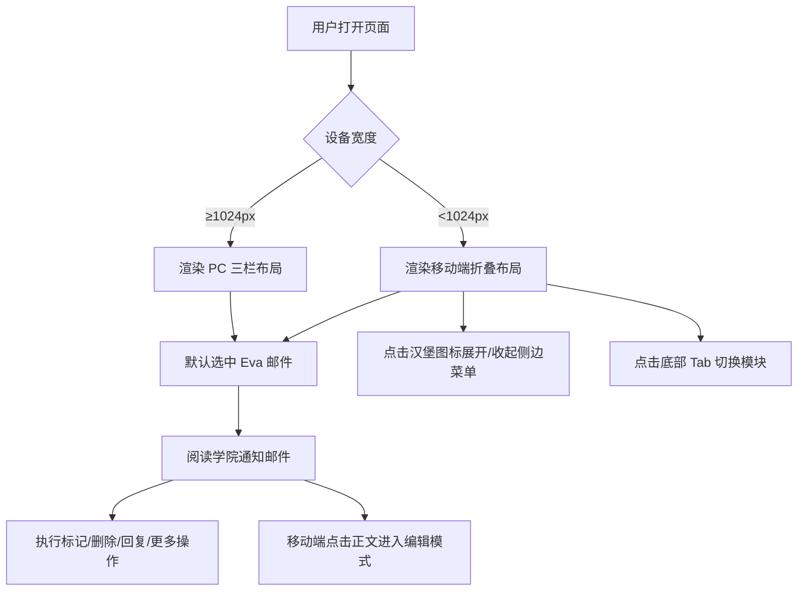

# 卡塞尔学院守夜人社区邮件情报后台 — 产品需求文档

## 1. 产品概述

为《龙族》世界观中的卡塞尔学院（Cassell College）打造一款复古欧式贵族秘党风格的响应式邮件情报后台。产品服务于“守夜人社区”成员，用于接收、阅读与管理学院下发的屠龙预警、任务派遣及内部邮件。

- **核心目标**：完整还原参考图中的邮件系统结构，建立统一的卡塞尔专属视觉规范，并在 PC 大屏桌面端与手机竖屏移动端之间实现自适应体验。
- **目标用户**：龙族粉丝、UI 设计展示、复古欧式风格爱好者。

## 2. 核心功能

### 2.1 功能模块

1. **邮件分类导航**：收件箱（带未读数字角标）、重要邮件、已发送、存档。
2. **联系人列表**：龙族原著联系人 Ricardo、村雨、狄克推多、炎之龙斩者、NoNo、守夜人、Eva，支持选中高亮；额外增加执行部、装备部、信息部分类标签。
3. **邮件详情阅读**：展示发件人、收件人、发送时间、标题、正文图文混排、操作按钮（标记、删除、回复、更多）。
4. **响应式布局**：
   - PC 端：宽屏三栏固定布局。
   - 移动端：侧边菜单可折叠，主区域默认展示邮件详情卡片，底部固定五栏 Tab 导航。
5. **邮件内容可编辑**：移动端邮件正文支持点击编辑。

### 2.2 页面详情

| 页面/视图 | 模块 | 功能描述 |
|-----------|------|----------|
| PC 大屏桌面端 | 顶部 Header | 校徽、CASSELL COLLEGE 标题、守夜人社区副标题、搜索与新建邮件图标 |
| PC 大屏桌面端 | 左侧窄侧边栏 | 邮件分类导航，收件箱带未读角标 |
| PC 大屏桌面端 | 中间联系人栏 | 原著联系人列表 + 部门标签，选中高亮 |
| PC 大屏桌面端 | 右侧邮件详情主面板 | 学院通知标题、发件人信息、台风卫星实拍图、完整正文、底部操作按钮 |
| PC 大屏桌面端 | 底部状态栏 | 极小卡塞尔拉丁文校训水印 |
| 手机竖屏移动端 | 顶部 Header | 校徽 + 学院标题 + 功能图标 |
| 手机竖屏移动端 | 折叠侧边菜单 | 收起仅留图标，展开显示邮件分类 + 完整联系人列表 |
| 手机竖屏移动端 | 邮件详情卡片 | 图文排版适配窄屏，正文可编辑 |
| 手机竖屏移动端 | 底部 Tab 导航 | 首页、通讯录、邮件、任务、设置，盾形线性图标 |

## 3. 核心流程

## 4. 用户界面设计

### 4.1 设计风格

- **主题**：复古欧式贵族秘党冷峻风格，亚麻米白羊皮纸质感，搭配橄榄墨绿与装饰鎏金。
- **色彩体系**：
  - 背景：#F5F0E1（亚麻米白羊皮纸纹理）
  - 主色：#4A5038（橄榄墨绿）
  - 装饰鎏金：#B89A67
  - 正文文字：#2C2C2C（深炭灰）
  - 导航选中项：橄榄绿底色 + 白色文字
- **纹理与装饰**：
  - 微弱纸张做旧噪点
  - 所有模块使用细金色分割边框
  - 盾形纹章、欧式细卷草暗纹
  - 半朽世界树暗水印（参考第二张图片）
- **字体规范**：
  - 英文标题：Times New Roman 复古衬线
  - 中文标题：Source Han Serif CN / Noto Serif SC（思源宋体）
  - 正文：系统黑体 / Noto Sans SC
  - 重点高亮：鎏金色 #B89A67
- **图标风格**：线性盾形纹章风格，金色描边，与欧式主题统一。

### 4.2 页面设计概述

| 页面/视图 | 模块 | UI 元素 |
|-----------|------|---------|
| PC 端 | Header | 圆形半朽世界树校徽、CASSELL COLLEGE 标题、守夜人社区副标题、搜索/新建图标 |
| PC 端 | 侧边栏 | 邮件分类列表、未读角标、金色分隔线 |
| PC 端 | 联系人栏 | 部门标签、联系人列表、选中态橄榄绿背景 |
| PC 端 | 邮件详情 | 大标题、发件人卡片、时间、正文段落、卫星台风图、操作按钮栏 |
| PC 端 | 状态栏 | 拉丁文校训水印 |
| 移动端 | Header | 校徽 + 学院标题 + 搜索/新建图标 |
| 移动端 | 侧边菜单 | 折叠态仅图标，展开态显示邮件分类 + 联系人 |
| 移动端 | 邮件详情卡片 | 窄屏图文排版、可编辑正文 |
| 移动端 | 底部 Tab | 五栏导航、盾形线性图标、未读角标 |

### 4.3 响应式策略

- **桌面优先（Desktop-first）**。
- **断点**：
  - 移动端：< 1024px
  - PC 大屏：≥ 1024px
- PC 端采用固定三栏：`sidebar(200px) + contacts(260px) + main(flex-1)`。
- 移动端侧边菜单默认折叠，点击汉堡图标展开覆盖层；主区域默认展示邮件详情。
- 图片在窄屏下宽度 100%，保持比例。

### 4.4 动画与微交互

- 侧边栏展开/收起：300ms ease-in-out。
- 导航选中态：背景色与文字色过渡 200ms。
- 按钮悬停：鎏金色高亮 + 轻微上移。
- 页面加载：内容区域淡入 + 轻微上移 stagger。
- 可编辑区域聚焦：金色边框 glow。
