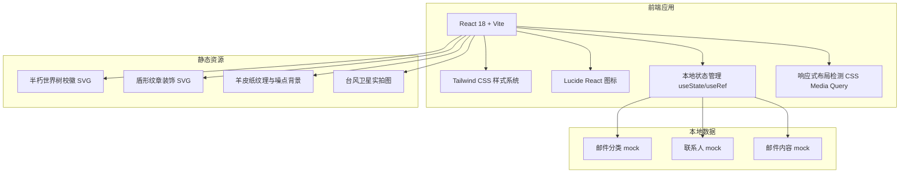

# 卡塞尔学院守夜人社区邮件情报后台 — 技术架构文档

## 1. 架构设计



## 2. 技术选型

- **前端框架**：React 18
- **构建工具**：Vite 5
- **样式方案**：Tailwind CSS 3 + 自定义 CSS 变量
- **图标库**：Lucide React（线性图标，可自定义 stroke 为鎏金色）
- **字体**：
  - 英文标题：Times New Roman（系统衬线）
  - 中文标题：Noto Serif SC（Google Fonts 思源宋体）
  - 正文：Noto Sans SC
- **响应式**：CSS `@media (min-width: 1024px)` 桌面优先
- **状态管理**：React useState（侧边栏展开/收起、选中联系人、邮件正文编辑态）
- **无后端**：所有数据为本地 mock，无需服务端。

## 3. 路由定义

| 路由 | 用途 |
|------|------|
| `/` | 邮件情报后台首页，根据视口自动渲染 PC 或移动端布局 |

## 4. 组件结构

```
src/
├── App.jsx                 # 根组件，响应式根布局
├── main.jsx                # 入口
├── index.css               # 全局样式、字体、CSS 变量、纹理
├── data/
│   └── mailData.js         # 邮件分类、联系人、邮件内容 mock
├── components/
│   ├── Header.jsx          # 顶部通栏（双端共用）
│   ├── SealLogo.jsx        # 半朽世界树校徽 SVG
│   ├── Sidebar.jsx         # 邮件分类导航
│   ├── ContactList.jsx     # 联系人/部门列表
│   ├── MailDetail.jsx      # 邮件详情主面板
│   ├── MailActions.jsx     # 标记/删除/回复/更多按钮
│   ├── MobileTabBar.jsx    # 移动端底部五栏 Tab
│   ├── MobileDrawer.jsx    # 移动端折叠侧边菜单
│   ├── ScrollVine.jsx      # 欧式卷草暗纹装饰
│   └── ShieldBadge.jsx     # 盾形纹章装饰
```

## 5. 数据模型

### 5.1 邮件分类

```javascript
const mailFolders = [
  { id: 'inbox', label: '收件箱', icon: 'Mail', unread: 1 },
  { id: 'important', label: '重要邮件', icon: 'Star' },
  { id: 'sent', label: '已发送', icon: 'Send' },
  { id: 'archive', label: '存档', icon: 'Archive' },
];
```

### 5.2 联系人

```javascript
const departments = [
  { id: 'exec', label: '执行部' },
  { id: 'gear', label: '装备部' },
  { id: 'info', label: '信息部' },
];

const contacts = [
  { id: 'ricardo', name: 'Ricardo', dept: 'exec' },
  { id: 'murata', name: '村雨', dept: 'gear' },
  { id: 'dictator', name: '狄克推多', dept: 'exec' },
  { id: 'dragon', name: '炎之龙斩者', dept: 'exec' },
  { id: 'nono', name: 'NoNo', dept: 'info' },
  { id: 'watchman', name: '守夜人', dept: 'info' },
  { id: 'eva', name: 'Eva', dept: 'info', selected: true },
];
```

### 5.3 邮件详情

```javascript
const mailDetail = {
  id: 'eva-001',
  subject: '学院通知：',
  sender: 'Eva',
  recipient: '你',
  time: '2026年7月9日 0:00',
  body: [
    '很遗憾通知你，你的假期提前结束了。',
    '学院的信息部在西北太平洋远洋海面检测到磁场异常，疑似龙族四大君主之一：天空与风之王复苏。检测到中心风力最大17级，已多次置换风眼，电磁场受不明因素影响，信号紊乱，狂风与雷鸣即将侵袭沿海。',
    'image:typhoon-satellite.jpg',
    '从学院的专员分布图和血统优势来看，无疑你是最合适人选。所以学院这次派遣你为本次行动专员，编号为SS0667021。装备部和校工部已提前行动，请立即出发。',
    '你亲爱的Eva',
  ],
};
```

## 6. 响应式断点

| 断点 | 宽度范围 | 布局 |
|------|----------|------|
| 移动端 | < 1024px | 单栏，折叠侧边菜单，底部 Tab |
| 桌面端 | ≥ 1024px | 三栏固定：sidebar + contacts + detail |

## 7. 关键实现细节

- **羊皮纸纹理**：使用 SVG noise filter + 细微网格/颗粒背景，通过 CSS `background-image` 或伪元素实现。
- **做旧噪点**：全局覆盖一层低透明度噪点 PNG/SVG，使用 `pointer-events: none`。
- **金色边框**：统一使用 `border-color: #B89A67`，线宽 1px。
- **半朽世界树水印**：作为固定背景水印，透明度 3-5%。
- **移动端编辑**：邮件正文使用 `contentEditable` 或 textarea，点击后进入编辑态。
- **动画**：全部使用 CSS transition，尊重 `prefers-reduced-motion`。
